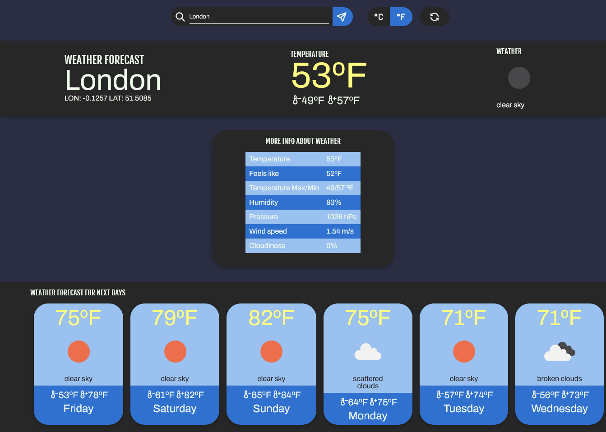

# Weather app
Your app to check local(or any city) weather forecast
[Click here and see]()
## Screenshots

## TODO
- [ ] Add system that find city to autocomplete when player search.
- [ ] If has two or more city with same name, request to player choose one.

## The Odin Project
This project was proposed in The Odin Project curriculum.
Goal: How works async functions and how to use api's